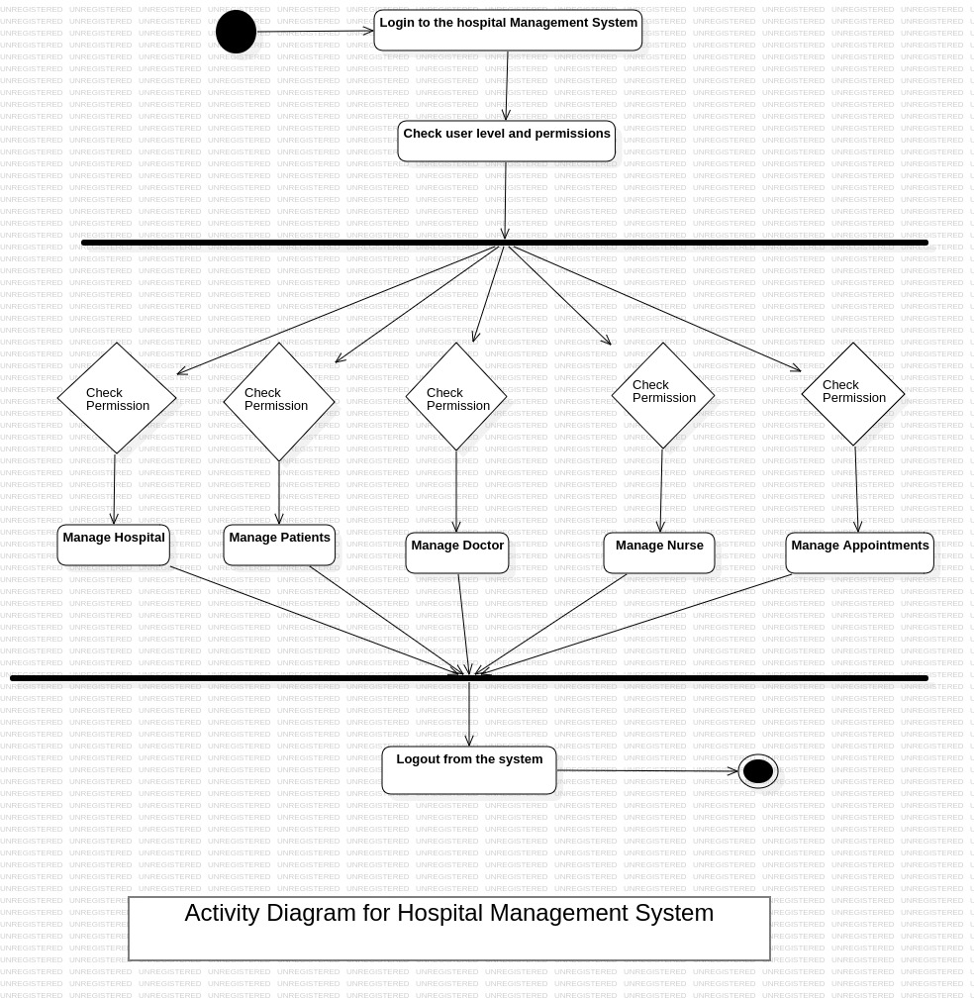
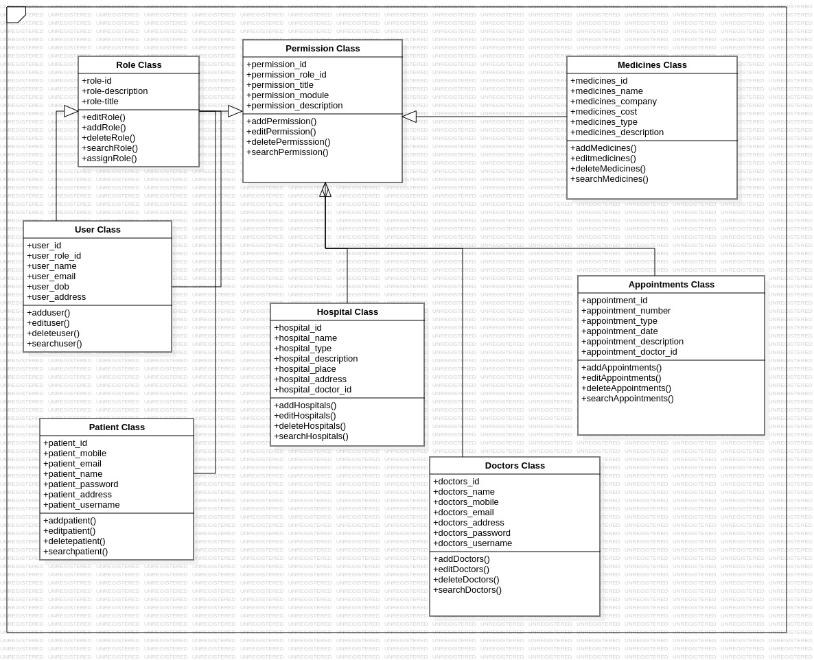
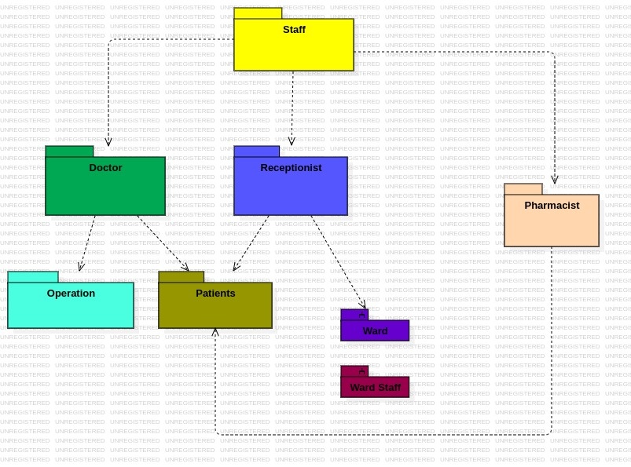
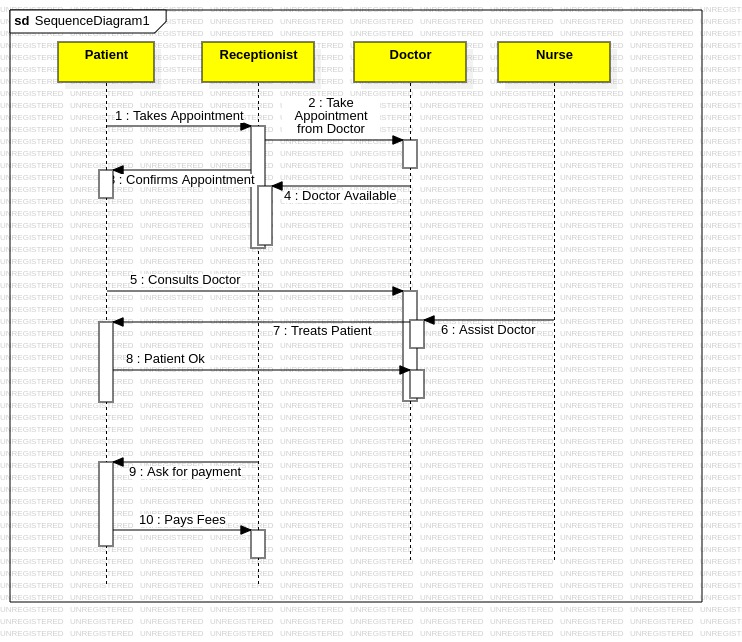
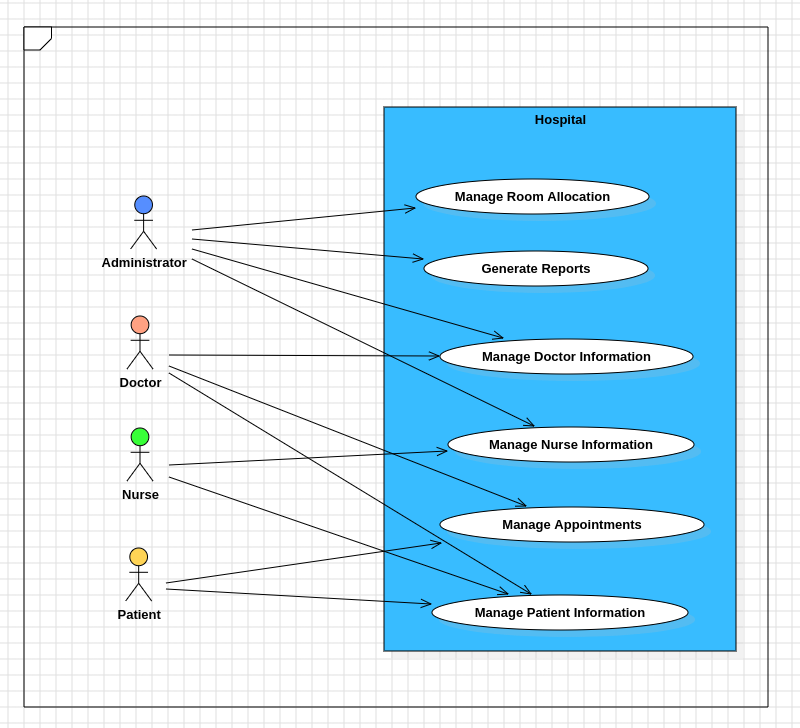
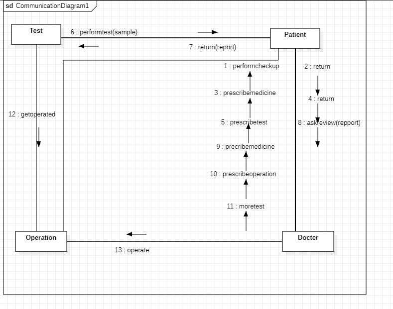

# LAB-4-Hospital-Management
### AIM:
To develop the Hospital management System using Star UML tool.
### PROBLEM STATEMENT:
It is very imporatant to maintain efficient software to handle information of a hospital.
This application provides a way to record this information and to access these in a simple way.

### UML DIAGRAMS:
```
DEVELOPED BY : KULASEKARAPANDIAN K
REGISTER NO : 212222240052
```

#### ACTIVITY DIAGRAM:


#### CLASS DIAGRAM:


#### PACKAGE DIAGRAM:


#### SEQENCE DIAGRAM:


#### USE CASE DIAGRAM:


#### COMMUNICATION DIAGRAM:


### RESULT:
Thus the Hospital management System project was executed and the output was verified.
